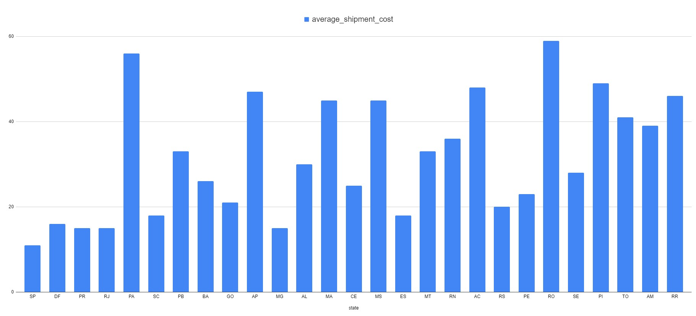
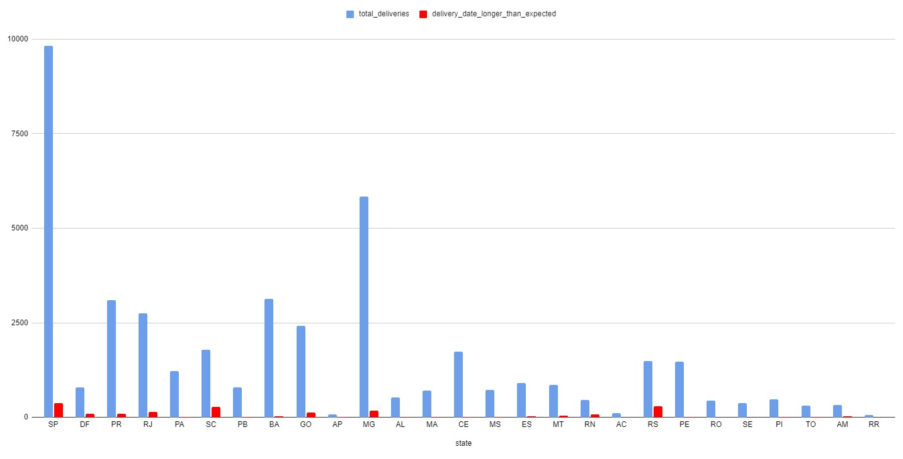

# Análise do Case de Logística

## Introdução

### Este relatório apresenta uma análise dos dados hipotéticos das entregas da empresa Cloudwalk de 08-09-2021 a 28-02-2023

Esta análise se baseia nos registros informados no arquivo [logistics-case-v4](./logistic-case-v4.csv).

### Padronização de registros

Inicialmente, um ponto importante visível nestes dados são os formatos de inserções de datas e horários onde nem todos os registros possuem a mesma formatação, onde por exemplo, no registro de id 20, não se encontram os horários de saída nem entrega do produto, afetando diretamente a segurança deste registro e dificultando a manipulação ou filtragem posterior destes dados, em vista que não possuem informações suficientes a respeito do pedido.

### Nordeste

Com base nestes registros, identifica-se um índice consirável de vendas na região nordeste do país porém alguns estados desta região possuem um valor de frete muito alto (como pode se observar uma média neste arquivo [shipment_cost_average_by_state](./shipment_cost_average_by_state.csv)) ou observando-a neste gráfico:

Considerando este fato e os recentes investimentos nesta região do país, uma possibilidade que poderia ser vantajosa seria a criação de um centro de distruibuição focado nesta região mas não se limitando-a, também considerando que viabilizaria a baixa nos custos de frete também em alguns estados do Norte como Pará, Tocantins e Roraima e também visando reduzir o tempo de entrega e aumentar a eficiência. Uma opção que poderia ser considerada nessa escolha, seria posicionar este centro em cidades como Feira de Santana, na Bahia, que fica próxima as principais rodovias da região e possui fácil acesso as regiões de Salvador e Aratu.

### Sul

Outro ponto interessante a se observar é a taxa de pedidos não entregues dentro do prazo em que se foi estimado, sendo Rio Grande do Sul e Santa Catarina com os maiores índices de atraso com 19.87% e 15.32% respectivamente, onde também se pode observar neste gráfico (baseado neste [arquivo](./estimated_date_failed.csv)) contendo a taxa de pedidos por estado e sua taxa de entrega após a data estimada.

Visando também uma diminuição no tempo de entrega e o valor do frete para estas regiões considerando um volume razoável de pedidos, talvez uma opção viável também fosse um centro de distruibuição voltado para este ponto como foi exemplificado anteriormente. Uma opção para este caso seria Porto Alegre, no Rio Grande do Sul, que é um importante centro de distribuição de produtos e possui acesso a portos, aeroportos e ferrovias, além de estar próxima a importantes rodovias da região.

## Conclusão e considerações finais

Gostaria de agradecer a oportunidade de participar desta etapa e processo seletivo e gostaria também de receber quaisquer feedbacks a respeito desta análise ou de quaisquer outros pontos em que poderia haver melhora.

Muito obrigado.

Foram utilizadas como ferramentas para esta análise:

 - Python
 - ChatGPT 
 - Google Spreadsheets
